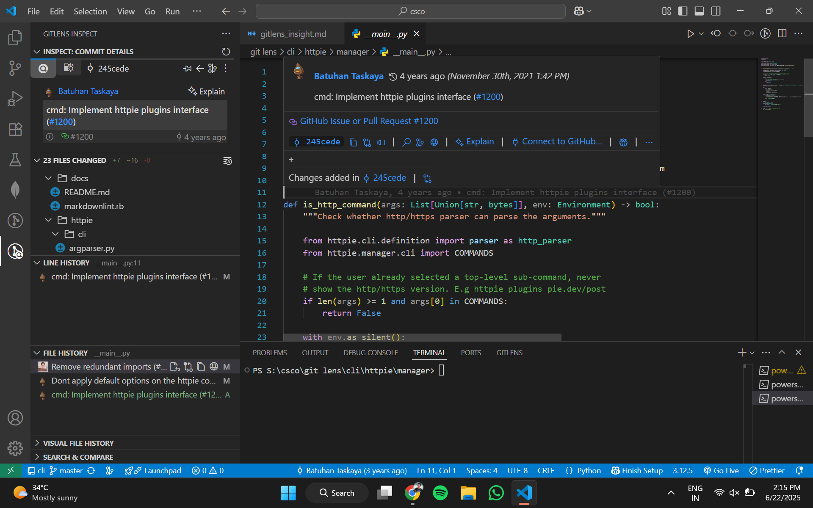

# 🔍 GitLens Insights Report

## Function
**File:** `cli/httpie/manage/__main__.py`  
**Function:**  
```python
def is_http_command(args: List[Union[str, bytes]], env: Environment) -> bool:


** 📌 Author Information **
Author: Batuhan Taskaya

Date Added: November 30th, 2021 at 1:42 PM

Commit Message: cmd: Implement httpie plugins interface (#1200)

Commit SHA: 245cede2c274bef7b172fe65814bfabc6f87b0b4


**Insights**
Using GitLens in Visual Studio Code:

The inline blame showed Batuhan Taskaya as the original author.

The file and line history confirmed the function was introduced and last modified in the same commit.

The commit message indicates it was part of a major feature addition for plugin support.

This investigation verifies authorship, change history, and context behind the function’s addition.

